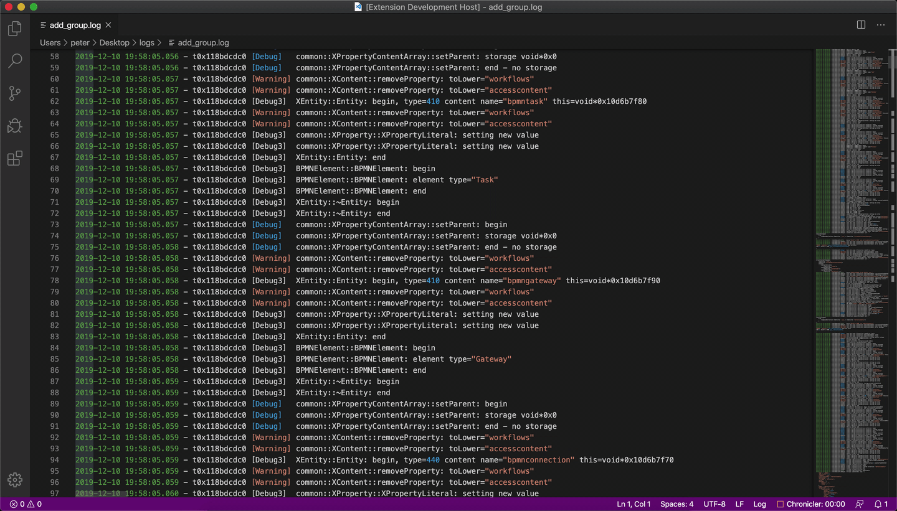

# Log Inspector

An extension to ease log file reading.

## Features

* Draw a flame graph generated from the log file.
  * Processes a 45MB file with 600k lines in a couple of seconds.

* Find the ending of a method corresponding to the specified beggining.
  * When cursor is on a line that has the "begin" keyword, this will find the line with the corresponding "end" keyword
  and select all the lines between them.

* Isolate log messages belonging to a specific thread.
  * Filter out all lines that do not contain the selected text (or the word under cursor if no selection).

## Usage
This extension is designed to work on log files, that follow a certain structure. While the specific
format of each line can be adjusted through the "logInspector.lineRegex" setting, each line should contain two fields. A 
'datetime' field, which can be passed as the input to the constructor of the Date object.
And a 'body' field that contains the text of the log. In this 'body' field, the beginings and endgings of a function call
should be marked by the "begin" and "end" keywords. The text before these two keywords will be used to match up the start
and end of the function. Any text after the keywords will be ignored.
Any line that does not match the "logInspector.lineRegex" is considered to be a continuation of the last real log line.

Some work was done, to handle inconsistent usage of the "begin" and "end" keywords.

The flame graph can be drawn of the entire file, of the logs that come after the current line (where cursor is)
or of the last cluster of logs. Two adjecant log lines are considered to be part of the same cluster if there is less
than one second between them.

## Thanks
Thank you for using Log Inspector.

